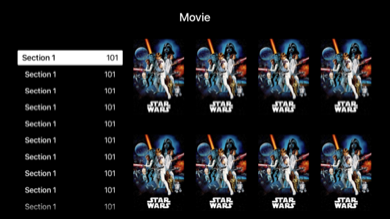

# TVMLKitchen😋🍴  [](https://raw.githubusercontent.com/Carthage/Carthage/master/LICENSE.md) [](https://github.com/Carthage/Carthage) [](https://www.bitrise.io/app/de994b854e5c425f)

[TVML](https://developer.apple.com/library/tvos/documentation/LanguagesUtilities/Conceptual/ATV_Template_Guide/) is a good choice, when you prefer simplicity over dynamic UIKit implementation. TVMLKitchen helps to manage your TVML **with or without additional client-server**.  Put TVML templates in Main Bundle, then you're ready to go.

Loading a TVML view is in this short.

```
Kitchen.serve(jsFile:"Catalog.xml.js")
```

Kitchen automatically looks for the jsFile in your Main Bundle, parse and load it, then finally pushes it to navigationController. User can pop to previous viewcontroller with AppleTV(Remote)'s **'Menu' button**.

# Getting Started

## Showing a Template from main bundle

1. Put your Sample.xml.js to your app's main bundle.

2. Prepare your Kitchen in AppDelegate's `didFinishLaunchingWithOptions:`.
    ```
    Kitchen.prepare(launchOptions)
    ```

3. Launch the template from anywhere.
    ```
    Kitchen.serve(jsFile: "Sample.xml.js")
    ```

## Showing a Template from client-server

<ol start="4">
<li><p>Got TVML server ? Just pass the URL String and you're good to go.</p>
    <pre><code>Kitchen.serve(urlString: "https://raw.githubusercontent.com/toshi0383/TVMLKitchen/master/SampleRecipe/Catalog.xml.js")</code></pre>

</li></ol>

## Advanced setup

- [x] Inject native code into TVML(javascript) context
- [x] Add error handlers

```
Kitchen.prepare(launchOptions, evaluateAppJavaScriptInContext:
{ appController, jsContext in
    /// set Exception handler
    /// called on JS error
    jsContext.exceptionHandler = {context, value in
        LOG(context)
        LOG(value)
        assertionFailure("You got JS error. Check your javascript code.")
    }

    /// SeeAlso: http://nshipster.com/javascriptcore/
    /// Inject native code block named 'debug'.
    let consoleLog: @convention(block) String -> Void = { message in
        print(message)
    }
    jsContext.setObject(unsafeBitCast(consoleLog, AnyObject.self),
        forKeyedSubscript: "debug")

}, onError: { error in
    let title = "Error Launching Application"
    let message = error.localizedDescription
    let alertController = UIAlertController(title: title, message: message, preferredStyle:.Alert )

    Kitchen.navigationController.presentViewController(alertController, animated: true) { }

})
```

## Kitchen Recipes
Though TVML view cannot be modified programatically after presented(or is there a way?), we can at least generate TVML dynamically by defining **Recipe**. Theme is customizable.

```
let banner = "Movie"
let thumbnailUrl = NSBundle.mainBundle().URLForResource("img",
    withExtension: "jpg")!.absoluteString
let actionID = "/title?titleId=1234"
let (width, height) = (250, 376)
let templateURL: String? = nil
let content = ("Star Wars", thumbnailUrl, actionID, templateURL, width, height)
let section1 = Section(title: "Section 1", args: (0...100).map{_ in content})
let catalog = CatalogRecipe<BlackTheme>(banner: banner, sections: (0...10).map{_ in section1})
Kitchen.serve(recipe: catalog)
```

### Default Theme


### Black Theme


**Note**: This feature is still in beta. APIs are subject to change.

### Available Recipes

- [x] Catalog
- [x] Catalog with select action handler
- [ ] Alert with button handler
- [ ] Rating with handler
- [ ] Compilation with select action handler
- [ ] Product with select action handler
- [ ] Product Bundle with select action handler
- [ ] Stack with select action handler
- [ ] Stack Room with select action handler
- [ ] Stack Separator with select action handler

and more...

## Note
We don't know when or how to inject additional data onto already presented TVML view.
For now, if you need 100% dynamic behavior, go ahead and use UIKit.

# Installation

## Carthage
Put this to your Cartfile,
```
github "toshi0383/TVMLKitchen"
```

Follow the instruction in [carthage's Getting Started section](https://github.com/Carthage/Carthage#getting-started).

# References
For implementation details, my slide is available.  
[TVML + Native = Hybrid](https://speakerdeck.com/toshi0383/tvml-plus-native-equals-hybrid)

# Contribution
Any contribution is welcomed🎉

